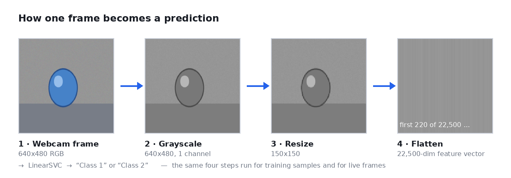
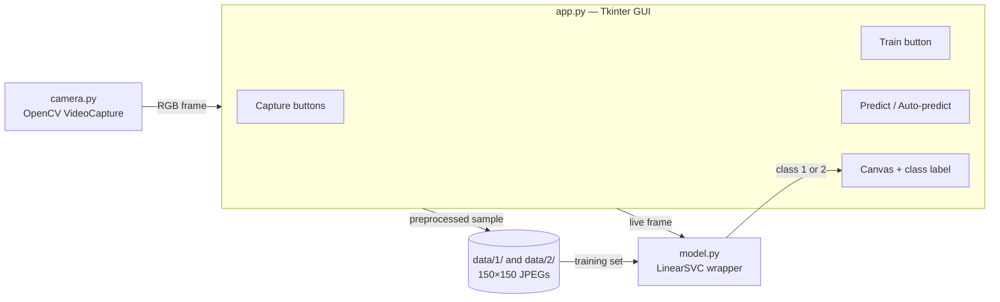
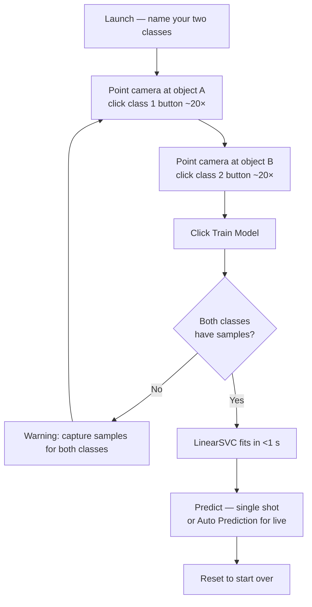

<div align="center">

# 📷 CamVision AI — Real-Time Webcam Classifier

**Teach your webcam to recognise anything in about thirty seconds.**

Point the camera at an object, click a button twenty times. Point it at a different object, click
another button twenty times. Hit **Train**. You now have a working live classifier — no dataset,
no GPU, no neural network, and a training step that finishes before you lift your finger off the mouse.

[](https://www.python.org/)
[](https://opencv.org/)
[](https://scikit-learn.org/)
[](https://docs.python.org/3/library/tkinter.html)
[](LICENSE)



</div>

---

## 📖 Overview

**CamVision AI** is a desktop app that builds an image classifier *interactively*, from frames you
capture yourself. It is a deliberately small, readable take on the "teachable machine" idea — around
200 lines of Python across four modules, with every step visible.

There is no deep learning here, and that is the point. A **LinearSVC** on raw grayscale pixels is
enough to separate two visually distinct objects, and it trains in well under a second on a laptop
CPU. The whole loop — capture, train, predict — happens live while you watch.

| | |
|---|---|
| **Task** | Binary image classification from a live webcam |
| **Model** | `LinearSVC` (linear Support Vector Machine) |
| **Features** | 22,500 raw grayscale pixels (150 × 150) |
| **Training data** | Whatever you capture — typically 15–20 frames per class |
| **Training time** | Under a second on CPU |
| **Dependencies** | OpenCV, scikit-learn, Pillow, NumPy, Tkinter |

---

## 🌟 Features

- 📹 **Live video feed** — continuous webcam streaming inside a Tkinter canvas
- 🖱️ **One-click dataset capture** — each click stores a preprocessed sample, with a running count on the button
- ⚡ **Instant training** — fit a fresh `LinearSVC` from the GUI, with a clear success or failure message
- 🔮 **Two prediction modes** — single-shot on demand, or continuous auto-prediction
- ♻️ **Reset** — wipe all samples and the model without restarting the app
- 🧹 **Consistent preprocessing** — training samples and live frames go through the exact same code path

---

## 🧠 How It Works

### The pipeline

Every frame — whether it is being saved as a training sample or classified live — passes through the
same four steps, shown in the figure above:

| Step | Operation | Result |
|:---:|---|---|
| 1 | Grab frame from webcam, BGR → RGB | `640 × 480 × 3` |
| 2 | Convert to grayscale | `640 × 480` |
| 3 | Resize to a fixed input size | `150 × 150` |
| 4 | Flatten to a feature vector | `22,500` values |

That vector goes straight into `LinearSVC`. No edge detection, no descriptors, no embeddings — the
classifier learns directly from pixel intensities, which is why the lighting and background need to
stay reasonably stable between training and prediction.

> Both paths share `model.preprocess()`. This matters more than it looks: if training samples and live
> frames are resized differently, the model quietly loses accuracy while appearing to work fine.

### Module layout



### The interaction loop



---

## 🚀 Installation

```bash
git clone https://github.com/Asrorbek0002/realtime-cam-classifier.git
cd realtime-cam-classifier

python3 -m venv venv
source venv/bin/activate          # Windows: venv\Scripts\activate

pip install -r requirements.txt
```

Requires **Python 3.10+**, a working webcam, and a display.

On Debian/Ubuntu, Tkinter ships separately from Python and is not installed by `pip`:

```bash
sudo apt install python3-tk
```

---

## ▶️ Usage

```bash
python main.py
```

1. **Name your classes.** Two dialogs appear at launch — for example `Pen` and `Notebook`, or
   `Open hand` and `Fist`. Cancel to fall back to `Class 1` / `Class 2`.
2. **Capture samples.** Hold the first object in front of the camera and click its button repeatedly,
   moving it slightly between clicks. Aim for **15–20 samples**. The button shows the running count.
   Repeat for the second object.
3. **Train.** Click **Train Model**. A popup confirms how many samples were used.
4. **Predict.** Click **Predict** for a single classification, or **Auto Prediction** to classify every
   frame continuously. The result appears under the video feed.
5. **Reset.** Clears all captured images and the trained model, so you can teach it something new.

Captured samples live in `data/1/` and `data/2/`. That folder is gitignored — it is your data, not
part of the project.

### Tips for good accuracy

- Keep the **background and lighting consistent** between capture and prediction; the classifier sees
  raw pixels, so a changed background is a changed image.
- **Vary the object slightly** while capturing — small shifts in position and angle prevent the model
  from memorising one exact frame.
- Pick objects that differ in **overall shape or brightness**, not just colour — everything is
  converted to grayscale before training.

---

## 📂 Project Structure

```text
realtime-cam-classifier/
├── main.py            # Entry point
├── app.py             # Tkinter GUI, capture/train/predict wiring
├── camera.py          # OpenCV webcam handler
├── model.py           # Preprocessing + LinearSVC wrapper, shared paths
├── requirements.txt   # Pinned dependencies
├── .gitignore
├── LICENSE
├── images/
│   └── pipeline.png   # The figure above
└── data/              # Created at runtime, gitignored
    ├── 1/             # Samples for class 1 (150×150 grayscale JPEGs)
    └── 2/             # Samples for class 2
```

---

## 🛠️ Troubleshooting

| Symptom | Cause and fix |
|---|---|
| `ValueError: Unable to open camera 0!` | Another app holds the webcam, or the device index is wrong. Close other apps, or try `Camera(index=1)` in [`app.py`](app.py). |
| `ModuleNotFoundError: No module named 'tkinter'` | Install the system package: `sudo apt install python3-tk`. |
| Black or frozen video feed | On macOS, grant camera permission under *System Settings → Privacy & Security → Camera*. |
| *"Capture samples for BOTH classes before training"* | A linear SVM needs at least two classes. Capture frames for both buttons. |
| Predictions look random | Too few samples, or the background changed since training. Capture more frames and keep the scene stable. |
| Webcam LED stays on after closing | Fixed — the window close handler now releases the device. Kill any stray Python process if it persists. |

---

## ⚠️ Limitations

This is an intentionally simple system, and it is honest about what that costs:

- **Two classes only.** The GUI is hard-wired for a binary problem.
- **Raw pixels, no invariance.** The model has no notion of translation, rotation, or scale. Move the
  object across the frame and accuracy drops.
- **Background-sensitive.** A different desk, a different shirt, or different lighting looks like a
  different image to the classifier.
- **No persistence.** The model lives in memory; closing the app discards it.

---

## 🎯 Future Improvements

- Support **N classes** with dynamically added buttons
- **Save and load** trained models with `joblib`
- Swap raw pixels for **HOG features** or a small **CNN embedding** for real robustness
- Show **live confidence scores** via `decision_function`
- A **confusion matrix** and held-out accuracy after training
- Dataset **augmentation** (flips, small rotations, brightness jitter) from the captured frames
- Export to **ONNX** for deployment outside Python

---

## 👨‍💻 Author

**Asrorbek Abdurazoqov**

AI Engineer | Python Developer

GitHub: [@Asrorbek0002](https://github.com/Asrorbek0002)

---

## 📄 License

Released under the [MIT License](LICENSE).

## ⭐ Support

If this project helped or interested you, consider giving it a ⭐ on GitHub.
It helps others find it and motivates future development.
